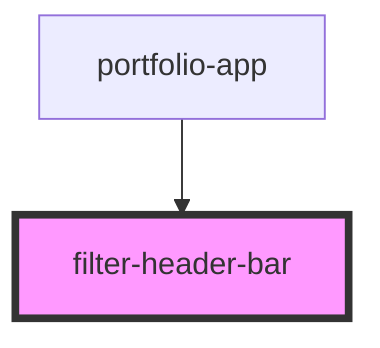

# filter-header-bar

<!-- Auto Generated Below -->

## Properties

| Property       | Attribute       | Description | Type       | Default                                                        |
| -------------- | --------------- | ----------- | ---------- | -------------------------------------------------------------- |
| `activeFilter` | `active-filter` |             | `string`   | `'all'`                                                        |
| `activeView`   | `active-view`   |             | `string`   | `'map'`                                                        |
| `filter`       | --              |             | `Function` | `undefined`                                                    |
| `view`         | --              |             | `Function` | `undefined`                                                    |
| `views`        | `views`         |             | `any`      | `{     'map': 'Property Map',     'grid': 'Property Grid'   }` |

## Dependencies

### Used by

 - [portfolio-app](../portfolio-app)

### Graph

----------------------------------------------

*Built with [StencilJS](https://stenciljs.com/)*
