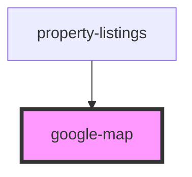

# google-map

<!-- Auto Generated Below -->

## Properties

| Property       | Attribute        | Description | Type       | Default     |
| -------------- | ---------------- | ----------- | ---------- | ----------- |
| `activePostId` | `active-post-id` |             | `any`      | `false`     |
| `baseUrl`      | `base-url`       |             | `any`      | `undefined` |
| `handleMarker` | --               |             | `Function` | `undefined` |
| `posts`        | `posts`          |             | `any`      | `[]`        |

## Dependencies

### Used by

 - [property-listings](../property-listings)

### Graph

----------------------------------------------

*Built with [StencilJS](https://stenciljs.com/)*
