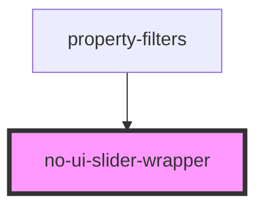

# no-ui-slider-wrapper

<!-- Auto Generated Below -->

## Properties

| Property   | Attribute | Description | Type       | Default     |
| ---------- | --------- | ----------- | ---------- | ----------- |
| `callback` | --        |             | `Function` | `undefined` |
| `el`       | --        |             | `Element`  | `undefined` |
| `max`      | `max`     |             | `any`      | `undefined` |
| `min`      | `min`     |             | `any`      | `undefined` |
| `slider`   | --        |             | `Element`  | `undefined` |
| `start`    | `start`   |             | `any`      | `undefined` |
| `title`    | `title`   |             | `string`   | `undefined` |

## Dependencies

### Used by

 - [property-filters](../property-filters)

### Graph

----------------------------------------------

*Built with [StencilJS](https://stenciljs.com/)*
