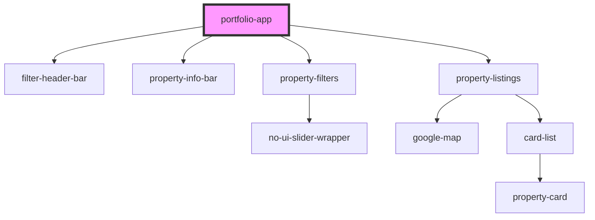

# portfolio-app

<!-- Auto Generated Below -->

## Properties

| Property       | Attribute        | Description | Type     | Default                                               |
| -------------- | ---------------- | ----------- | -------- | ----------------------------------------------------- |
| `googleApiKey` | `google-api-key` |             | `string` | `undefined`                                           |
| `urlToFetch`   | `url-to-fetch`   |             | `string` | `'http://bixbyland.test/wp-json/bixby/v1/properties'` |

## Dependencies

### Depends on

- [filter-header-bar](../filter-header-bar)
- [property-info-bar](../property-info-bar)
- [property-filters](../property-filters)
- [property-listings](../property-listings)

### Graph

----------------------------------------------

*Built with [StencilJS](https://stenciljs.com/)*
