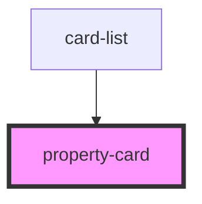

# property-card

<!-- Auto Generated Below -->

## Properties

| Property       | Attribute        | Description | Type  | Default     |
| -------------- | ---------------- | ----------- | ----- | ----------- |
| `activePostId` | `active-post-id` |             | `any` | `false`     |
| `postData`     | `post-data`      |             | `any` | `undefined` |
| `view`         | `view`           |             | `any` | `undefined` |

## Dependencies

### Used by

 - [card-list](../card-list)

### Graph

----------------------------------------------

*Built with [StencilJS](https://stenciljs.com/)*
