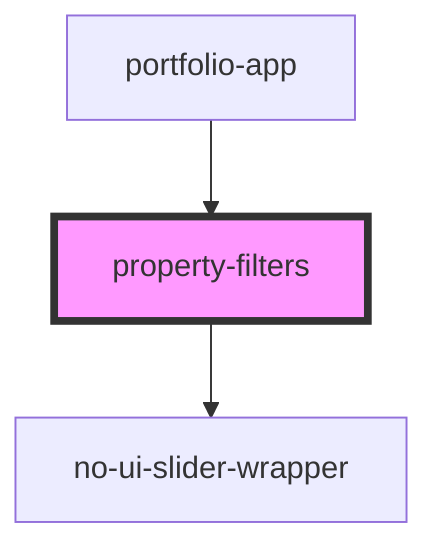

# property-filters

<!-- Auto Generated Below -->

## Properties

| Property  | Attribute  | Description | Type  | Default     |
| --------- | ---------- | ----------- | ----- | ----------- |
| `baseUrl` | `base-url` |             | `""`  | `undefined` |
| `filters` | `filters`  |             | `any` | `undefined` |
| `posts`   | `posts`    |             | `any` | `[]`        |
| `search`  | `search`   |             | `any` | `undefined` |

## Dependencies

### Used by

 - [portfolio-app](../portfolio-app)

### Depends on

- [no-ui-slider-wrapper](../no-ui-slider-wrapper)

### Graph

----------------------------------------------

*Built with [StencilJS](https://stenciljs.com/)*
