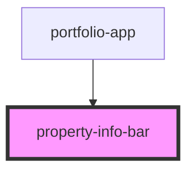

# property-info-bar

<!-- Auto Generated Below -->

## Properties

| Property   | Attribute  | Description | Type                      | Default                    |
| ---------- | ---------- | ----------- | ------------------------- | -------------------------- |
| `baseUrl`  | `base-url` |             | `any`                     | `undefined`                |
| `category` | `category` |             | `any`                     | `undefined`                |
| `filters`  | --         |             | `{ "category": string; }` | `{     "category": ""   }` |
| `posts`    | `posts`    |             | `any`                     | `[]`                       |

## Dependencies

### Used by

 - [portfolio-app](../portfolio-app)

### Graph

----------------------------------------------

*Built with [StencilJS](https://stenciljs.com/)*
