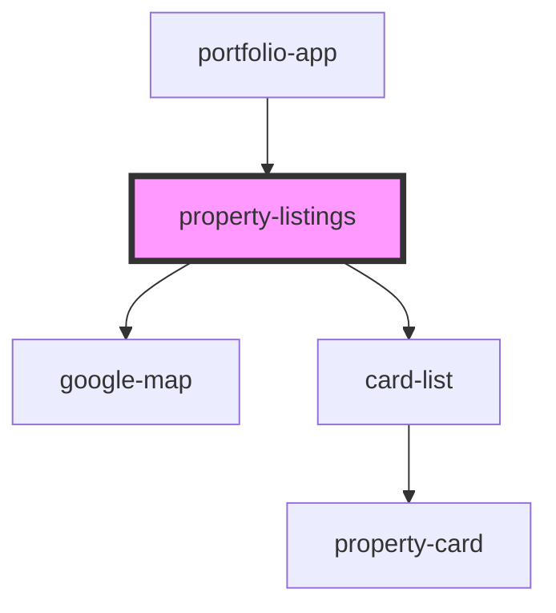

# property-listings

<!-- Auto Generated Below -->

## Properties

| Property       | Attribute        | Description | Type     | Default     |
| -------------- | ---------------- | ----------- | -------- | ----------- |
| `activePostId` | `active-post-id` |             | `any`    | `null`      |
| `posts`        | `posts`          |             | `any`    | `undefined` |
| `view`         | `view`           |             | `string` | `undefined` |

## Dependencies

### Used by

 - [portfolio-app](../portfolio-app)

### Depends on

- [google-map](../google-map)
- [card-list](../card-list)

### Graph

----------------------------------------------

*Built with [StencilJS](https://stenciljs.com/)*
